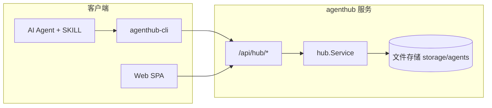

# AgentHub

AgentHub 是一个轻量级的 **Agent 包注册中心**：用 HTTP API 和 CLI 管理、分发面向不同运行时（如 PicoClaw、OpenClaw）的 agent 技能包，并附带可选的 Web 管理界面。

## 功能概览

| 能力 | 说明 |
|------|------|
| 按 category 分类 | 支持 `picoclaw`、`openclaw` 等运行时类别，安装时可强制校验 |
| 多版本存储 | 每个 agent 可保留多个版本，默认使用 `latest` / 最新版 |
| ZIP 上传与校验 | 上传 ZIP、自动解压、剥离单层根目录、路径穿越防护 |
| 只读浏览 | 列表、详情、单文件读取、整包 ZIP 下载无需鉴权 |
| 受控写入 | 上传、元数据更新、在线改文件、删除需 `upload_token` |
| CLI + Web | `agenthub-cli` 供脚本/Agent 调用；`web/` 提供浏览与编辑 UI |

## 架构



- **服务端**（`cmd/agenthub`）：Gin HTTP 服务，业务在 `internal/hub`，存储为本地目录树。
- **CLI**（`cmd/agenthub-cli`）：封装 `internal/client`，默认读 `agenthub-cli.toml`。
- **前端**（`web/`）：Vite + React，构建产物由服务端托管在 `web/dist`（相对 `storage` 的兄弟目录）。

## 目录结构

```
agenthub/
├── cmd/
│   ├── agenthub/          # 服务端入口
│   └── agenthub-cli/      # 命令行工具
├── internal/
│   ├── archive/           # ZIP 解压、路径安全、标识符校验
│   ├── client/            # Hub HTTP 客户端
│   ├── config/            # TOML 配置加载
│   ├── hub/               # 领域模型、存储、API 路由、鉴权
│   └── router/            # 应用路由、CORS、静态前端、健康检查
├── web/                   # 管理界面（React）
├── skills/agenthub/       # 供 AI Agent 使用的 SKILL 说明
├── agenthub-cli.example.toml
└── storage/               # 运行时数据（gitignore）
    └── agents/
        └── <agentName>/
            ├── meta.json
            └── versions/<version>/...
```

## 快速开始

### 环境要求

- Go 1.25+
- （可选）Node.js 18+，用于构建 Web UI

### 1. 配置并启动服务端

在项目根目录创建 `agenthub-server.toml`（该文件已在 `.gitignore` 中，勿提交 token）：

```toml
addr = ":9093"
storage_dir = "./storage"
# 留空则禁止所有写操作（上传/更新/删除）
upload_token = "your-secret-token"
```

启动：

```bash
go run ./cmd/agenthub
# 或指定配置路径
go run ./cmd/agenthub -config /path/to/agenthub-server.toml
```

健康检查：`GET http://localhost:9093/health`

也可通过环境变量 `AGENTHUB_SERVER_CONFIG` 指定配置文件路径。

### 2. 配置 CLI

```bash
cp agenthub-cli.example.toml agenthub-cli.toml
```

编辑 `agenthub-cli.toml`，**`url` 需与服务端 `addr` 一致**（示例默认为 `http://localhost:9093`）：

```toml
url = "http://localhost:9093"
upload_token = "your-secret-token"   # 仅 upload 需要，与服务端一致
```

构建 CLI：

```bash
go build -o agenthub-cli ./cmd/agenthub-cli
```

### 3. 常用 CLI 操作

所有子命令支持 `--json`；**全局与子命令的 flag 须写在位置参数之前**。

```bash
# 支持的 category
agenthub-cli --json categories

# 按运行时筛选
agenthub-cli --json list --category picoclaw

# 查看包详情与文件树
agenthub-cli --json get <agentName>

# 安装到本地（建议始终带 --expect-category）
agenthub-cli --json install --expect-category picoclaw --dest ./agents/<agentName> <agentName>

# 上传 ZIP（需 upload_token）
agenthub-cli --json upload --category picoclaw --version 1.0.0 <agentName> ./package.zip
```

### 4. Web 界面（可选）

```bash
cd web
npm install
npm run build
```

重新启动 `agenthub` 后访问 `http://localhost:9093/`。若未构建前端，非 API 路由会提示运行 `cd web && npm run build`。

开发模式可单独跑 Vite：`cd web && npm run dev`（需自行配置 API 代理或指向已启动的后端）。

## Agent Category 与包规范

| Category | 说明 | 上传校验（代码） |
|----------|------|------------------|
| `picoclaw` | PicoClaw 运行时 agent | 无强制清单文件（默认可为空 category，归一化为 picoclaw） |
| `openclaw` | OpenClaw 运行时 agent | 包内须包含 `AGENT.md` |
| 其他自定义 category | 标识符规则同 agent 名 | 须包含 `AGENT.md` |

`agenthub-cli install --expect-category <runtime>` 会在安装前比对 Hub 上登记的 category，不匹配则中止，避免把 OpenClaw 包装进 PicoClaw 环境。

上传 ZIP 建议结构：包文件在 ZIP 根目录，或仅包一层顶层目录（服务端会自动 `StripSingleRootDir`）。

## HTTP API

基础路径：`/api/hub`。响应经 `ginx` 封装，形如 `{ "code", "errMsg", "body" }`；CLI 的 `internal/client` 已解析该格式。

| 方法 | 路径 | 鉴权 | 说明 |
|------|------|------|------|
| GET | `/categories` | 否 | 返回已知 category 列表 |
| GET | `/agents?category=` | 否 | 列出 agent；`category` 可选 |
| GET | `/agents/:agentName` | 否 | 详情 + 文件树；`?version=` 可选 |
| GET | `/agents/:agentName/files/*filepath` | 否 | 读取包内文件内容 |
| GET | `/agents/:agentName/download` | 否 | 下载指定版本 ZIP |
| POST | `/agents` | 是 | multipart 上传：`agentName`, `category`, `version`, `file` |
| PUT | `/agents/:agentName` | 是 | JSON 更新 `displayName`, `summary`, `category` |
| PUT | `/agents/:agentName/files/*filepath` | 是 | JSON：`version`, `content` |
| DELETE | `/agents/:agentName` | 是 | 删除整个 agent |

写操作鉴权：请求头 `Authorization: Bearer <upload_token>` 或 `X-Upload-Token: <upload_token>`。服务端未配置 `upload_token` 时，写接口返回 401。

只读接口对公网开放时，请自行评估暴露范围；生产环境建议在反向代理层限制写接口来源。

## 存储模型

每个 agent 对应目录 `storage/agents/<agentName>/`：

- `meta.json`：名称、category、展示名、摘要、版本列表、`latestVersion`、`updatedAt`
- `versions/<version>/`：该版本的解压后文件树

未指定 `version` 时，API 与 CLI 使用 `latest` 或 `meta.latestVersion`。

上传大小上限：**200MB**（服务端 multipart 与 ZIP 条目均有限制）。

## 配置参考

### 服务端 `agenthub-server.toml`

| 字段 | 默认值 | 说明 |
|------|--------|------|
| `addr` | `:9093` | 监听地址 |
| `storage_dir` | 配置文件同目录下的 `./storage` | agent 数据根目录 |
| `upload_token` | 空 | 非空则启用写接口鉴权 |

### CLI `agenthub-cli.toml`

| 字段 | 默认值 | 说明 |
|------|--------|------|
| `url` | `http://localhost:8080`（示例文件为 9093） | Hub 根 URL |
| `upload_token` | 空 | 覆盖配置的上传 token |

环境变量：`AGENTHUB_CLI_CONFIG`、`AGENTHUB_SERVER_CONFIG` 可指向配置文件路径。

命令行可覆盖：`agenthub-cli --url ... --token ... --config ...`

## 开发与测试

```bash
# 运行全部 Go 测试
go test ./...

# 构建
go build -o agenthub ./cmd/agenthub
go build -o agenthub-cli ./cmd/agenthub-cli
```

## AI Agent 集成

仓库内 `skills/agenthub/SKILL.md` 描述了面向 Cursor 等 Agent 的标准工作流：按本地 runtime 用 `list --category` 筛选 → `get` 确认 → `install --expect-category` 安装 → 读取 `SKILL.md` / `AGENT.md` 使用。

将 `agenthub-cli` 放入 `PATH` 并在工作目录提供 `agenthub-cli.toml` 即可被 Skill 驱动。

## 安全提示

- **不要将** `agenthub-server.toml` / 含真实 `upload_token` 的文件提交到版本库。
- `install` 会先 **删除并重建** `--dest` 目录，避免指向重要路径。
- ZIP 解压拒绝路径穿越与符号链接；agent 名与版本号须满足标识符规则（见 `internal/archive`）。
- Web UI 在配置了 `upload_token` 时，会通过注入的 `<meta name="upload-token">` 供前端写操作使用，部署时应注意仅在内网或受信环境使用。

## 许可证

未在仓库中声明许可证；使用前请与维护者确认。
